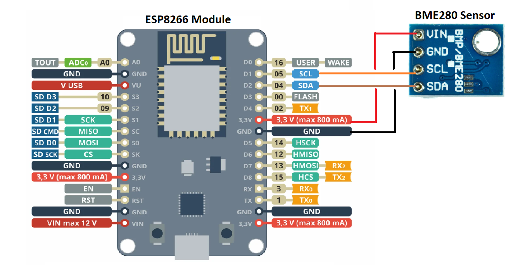

## SmartThermostat
SmartThermostat is a service that allows you to control your home thermostat remotely through your local network. It consists of a server application running on a Raspberry Pi and a client webapp that interacts with the server. The webapp itself is also served by the same server but could be also seperated.

## Schematics
#### Thermostat Controller Diagram
The thermostat controller is used to turn the thermostat on and off. It makes use of a raspberry pi that runs the smart thermostat service.

#### WiFi Sensors Diagram
Additional WiFi sensors can be added to the smart thermistat service. They are making use of an ESP8266 module and a BME280 sensor connected to it through SPI. The ./sensors/esp8266.io code can be uploaded to ESP8266 with Arduino IDE to serve the BME280 readings.

## Installation
* Prepare the thermostat controller hardware as shown in the schematics (the oled display is optional)
* Clone the repo in the raspberry py and execute the scripts below:
    * **./prerequisites.sh**: to install all needed prerequisites
    * **./build.sh**: to build the client webapp and link it to the server
    * **./server/smartThermostat.py**: to start the Smart Thermostat server (it also serves the client webapp)
* The webapp will run on port **6969** by default. You can change the port in the data.json file, after the initial execution of **./server/smartThermostat.py** script.
* Additional sensors can be added through the webapp. The sensors can either be connected directly to the raspberry pi or connected remotely.

## Disclaimer
Make sure you know what you do before you do anything, the author accepts no responsibility for any damage to your equipment.