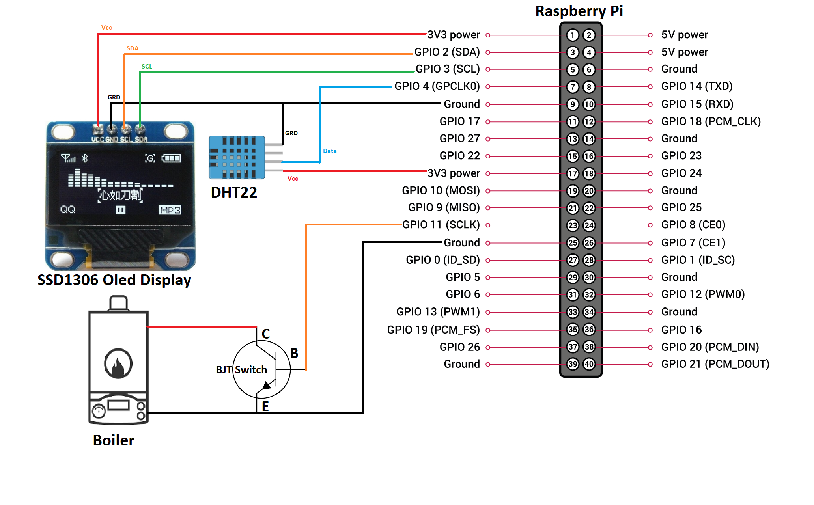
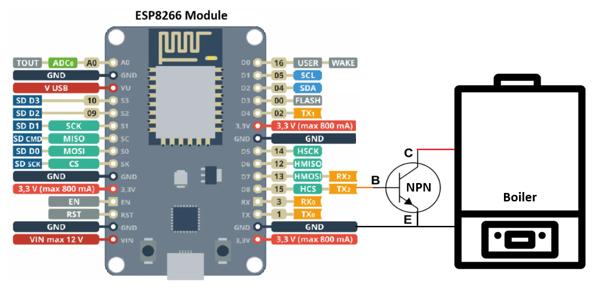
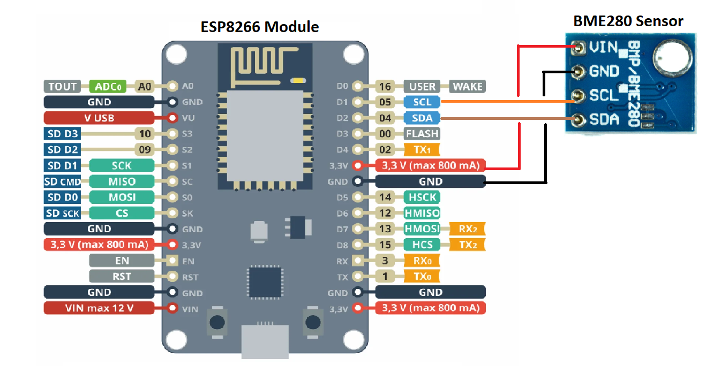

## SmartThermostat
SmartThermostat is a service that allows you to control your home thermostat remotely through your local network. It consists of a server application that controls all communications between the remote devices and a client Web APP that interacts with the server. The Web APP itself is also served by the server but could be also separated.

## Schematics
#### Thermostat Controller Diagram
The thermostat controller is used to turn the thermostat on and off.
The thermostat can be controlled either by connecting the thermostat to a physical GPIO pin on a Raspberry Pi server or remotely through an ESP8266 module. Below are the schematics for both types of connections.

Physical thermostat connection through Raspberry Pi GPIO pins:

*This is the default setup. The default sensor and thermostat setup can be changed from the **consts.py** script. The oled module is commented out in the code by default and it's optional.*

Remote thermostat connection through ESP8266 module:

#### WiFi Sensors Diagram
Additional WiFi sensors can be added to SmartThermostat. They are making use of an ESP8266 module and a BME280 sensor connected to it through SPI. There is also support for a physical DHT22 temperature sensor connected to a Raspberry Pi server that runs the SmartThermostat.

## Installation
* Prepare your setup based on the diagrams above and the sketches in the devices folder.
* Clone the repo and execute the scripts below:
    * **./prerequisites.sh**: to install all needed prerequisites
    * **./build.sh**: to build the client webapp and link it to the server
    * **./server/smartThermostat.py**: to start the Smart Thermostat server (it also serves the client webapp)
    * **./install_as_servicev.sh**: run this script optionally to install smartThermostat as a service that starts automatically on boot
* The Web APP will run on port **6969** by default. You can change the port in the data.json file, after the initial execution of **./server/smartThermostat.py** script.
* Remote devices (sensors or thermostat controllers) can be added through the Web APP or the data.json file after the initial execution of the server.

## To Do List
- ✅ Option to schedule required temperatures
- ✅ Option for remote sensors
- ✅ Option for remote thermostat control [*to be tested and refined*]
- ⬜️ Remote thermostat settings on the Web APP
- ⬜️ Option for cooling control
- ⬜️ Option to handle multiple thermostat controllers

## Disclaimer
Make sure you know what you do before you do anything, the author accepts no responsibility for any damage to your equipment.